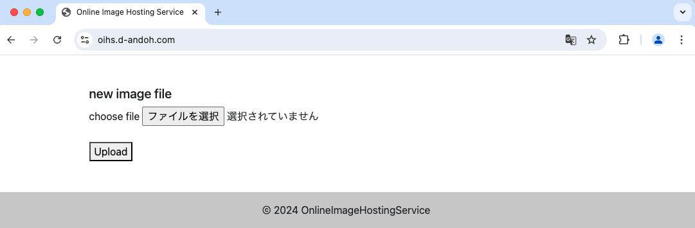
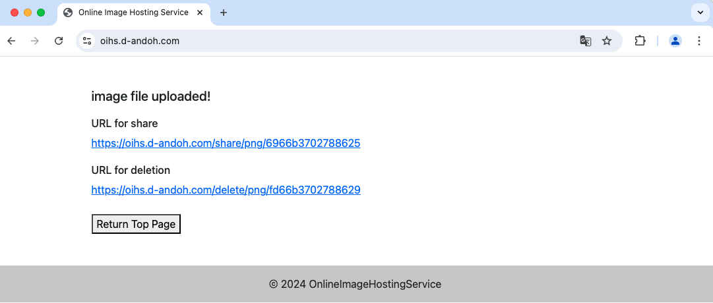
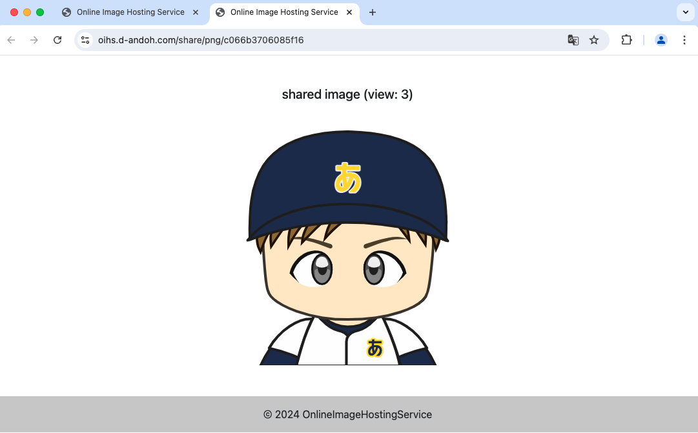
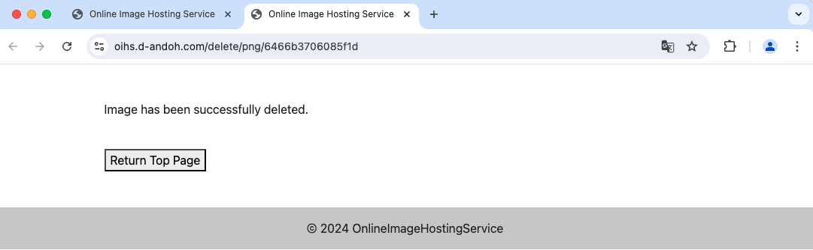

# online-image-hosting-service


## URL

https://oihs.d-andoh.com

## About

このアプリケーションは、画像のシェアリングサービスです。
ユーザーアカウントは不要で、アップロードしたファイルに一意のURLが生成されます。

生成されたURLは設定した期限を過ぎると無効になります。

## Usage

トップ画面で共有したい画像を選択します。
選択可能なファイルタイプは `png`, `jpeg(jpg)`, `gif` です。



`Upload` をクリックすると、共有用のURLと削除用のURLが生成されます。



共有用のURLにアクセスすると、画像を閲覧できます。



削除用のURLにアクセスすると、画像を削除します。
この操作後は、共有用URL、削除用URLどちらも無効となります。



## Development

### Set Up

1. DB初期化

```
$ php Database/Migrator/index.php migrate -i
```

2. 環境変数設定

`.env.template` から `.env` を作成し、環境変数値を設定します。

```
$ cp .env.template .env
```

3. ローカルサーバー起動

```
$ php -S localhost:8000 -t Public
```

### Database Migration

1. マイグレーションファイル生成

以下のコマンドを実行すると、`Database/Migrations/yyyy-mm-dd_[unix_timestamp]_[file_name].php` というマイグレーションファイルが生成されます。

```
$ php Database/Migrator/index.php code-gen migration --name [file_name]
```

マイグレーションファイルの `up` にマイグレーションロジック、`down` にロールバックロジックを記述します。

```php: Database/Migrations/yyyy-mm-dd_[unix_timestamp]_[file_name].php
<?php

namespace Database\Migrations;

use Database\Migrator\SchemaMigration;

class CreateSampleTeble implements SchemaMigration {
    public function up(): array {
        // マイグレーションロジックをここに追加
        return [];
    }

    public function down(): array {
        // ロールバックロジックを追加
        return [];
    }
}
```

2. マイグレーション実行

```
$ php Database/Migrator/index.php migrate
```

3. ロールバック実行

ロールバック時は、`--rollback`（`-r`）オプションを使用します。

```
$ php Database/Migrator/index.php migrate --rollback
or
$ php Database/Migrator/index.php migrate -r
```

また、ロールバックオプションに続けて整数値を設定すると、その回数分ロールバックを実行します。

```
# 現在のバージョンから2回分ロールバックする
$ php Database/Migrator/index.php migrate -r 2
```
